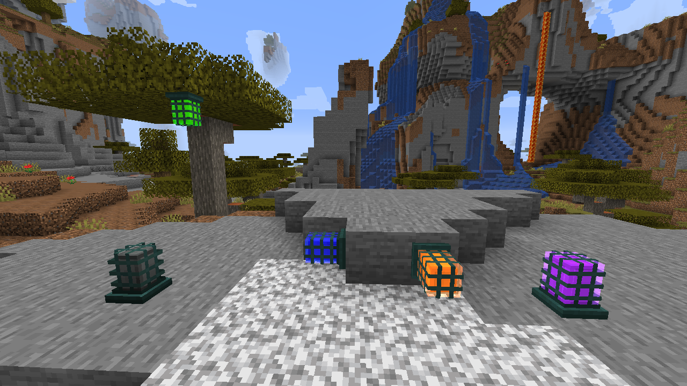

Namespaced ID: yttr:cage_lamp
# Cage Lamp

Cage Lamps are smaller versions of [Lamps](/lamp) which can be placed on any of the 6 block faces,
enclosed in a decorative industrial cage.

See the [Lamp](/lamp) page for more information on how lamps work, including these.

## Screenshots

## Recipes

###   Cage Lamp from Fixture

	
	

		
	

###   Inversion

	
	

		
		
	

	
	

		
		
	

## Recipe Usages

###   Cage Lamp to Fixture

	
	

		
	

###   Recombine Cage Lamps

	
	

		
		
		
		
	

