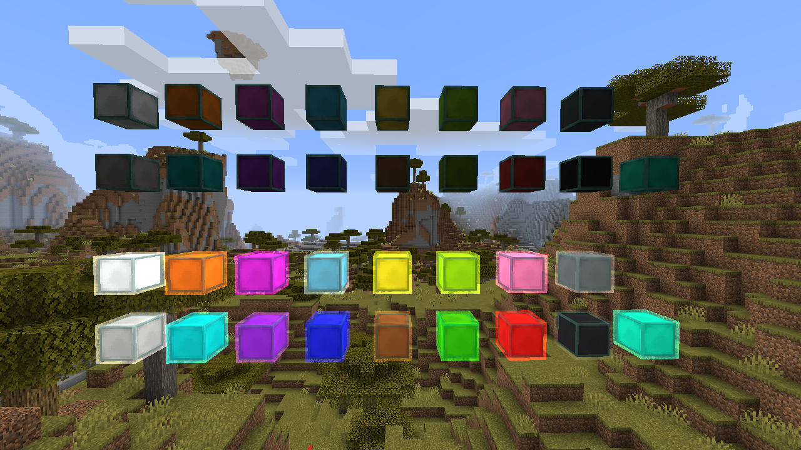
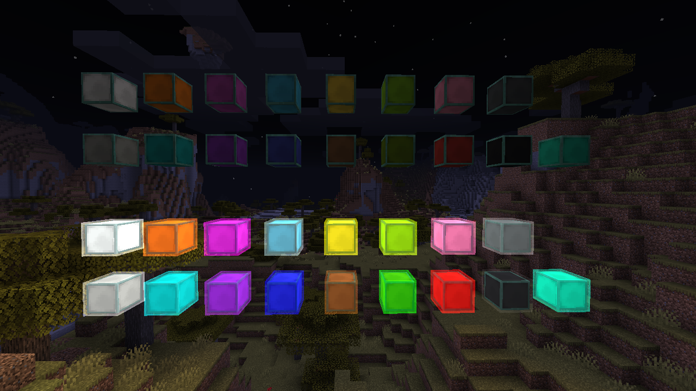

Namespaced ID: yttr:lamp
# Lamp

Lamps are simple redstone-controlled glowing blocks (light level 15) with a "halo" effect that makes
them more visually interesting.

They can be dyed any of the 16 vanilla colors and optionally inverted. When inverted, they are on
by default and turned off by a redstone signal.

There is an additional 17th "teal" color currently not obtainable in survival.

## Screenshots

## Recipes

###  Lamp

	

		
	

	

		
		
		
		
		
		
		
		
		
	

###  Inverted Lamp

	

		
	

	

		
		
		
		
		
		
		
		
		
	

###  Inversion

	

		
	

	

		
		
	

	

		
	

	

		
		
	

###  Recombine Fixtures/Cage Lamps

	

		
	

	

		
		
		
		
	

## Recipe Usages

###  Fixture

	<a href="/fixture" class="output">
		
		4
	</a>
	

		
	

